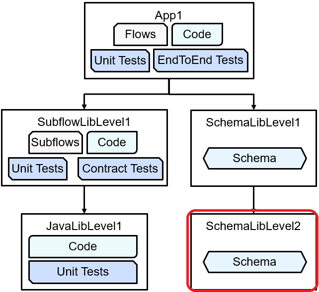

# ace-submodule-schemalib-level2

ACE submodule schema library level2

This is the bottom library in a hierarchy of repositories:

Schema library 1: https://github.com/trevor-dolby-at-ibm-com/ace-submodule-schemalib-level1

Originally created for a [blog post](https://community.ibm.com/community/user/integration/blogs/trevor-dolby/2023/04/03/automated-multi-repo-app-connect-enterprise-ace-ba).

This repo is intended to be used as part of the application, and not as an independent ACE object. 
